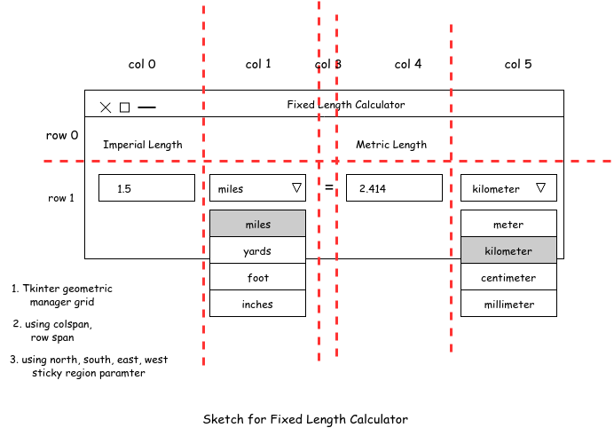
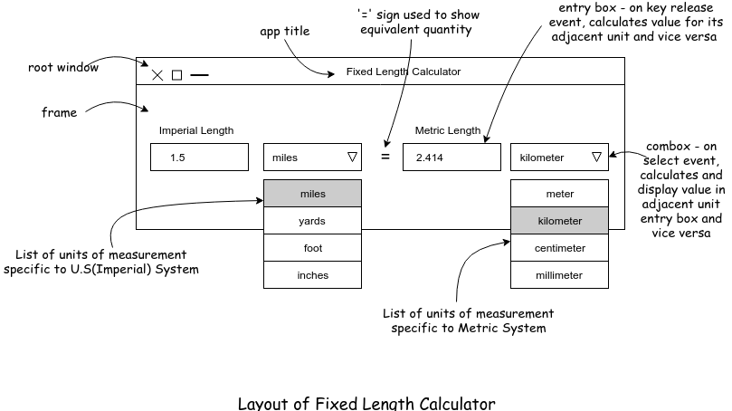
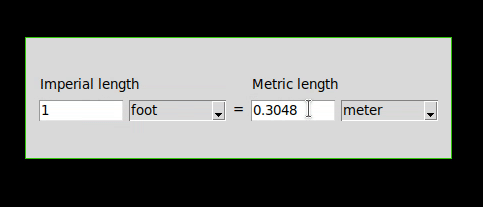

### 1. Background
- A standalone application which runs on a Laptop/Desktop computer. The application is build using the lightweight GUI library ‘tkinter’ belonging to python programming language.
- This application will serve users who want to get acquainted with yet another measurement system used for measuring 1 dimension quantity - length, than they are already used to in their daily lives.
- Foreign visitors who are unfamiliar with measurements used to measure quantity in foreign
country.
- The main function of this application is that it calculates and converts distance/length measured between
two fixed points from one system of unit to another and vice versa. So, more specifically, this
application allows the user to convert units used to measure length from US/Imperial system to Metric
system.

Coming on the requirement side,
- The US/Imperial units of measurement used to measure a linear dimension include inches, feet, yards,
and miles. While the Metric system includes meter, centimeter, millimeter, and kilometer.
- The application should accept Integers(-ve and +ve) for both systems of measurements and allow 4
digits after decimal.
- GUIs are made up of frames which represent a window on screen, Frames hold components/widgets. For
this application, there will be 2 drop down buttons(combobox, in case of tkinter), 2 textboxes, 2 labels
for indicating the type of measurements above the respective combobox and finally application title will
go on window status bar.
- The layout manager(tkinter geometric manager) will be used to control size and placement of widgets on
the frame. So that all widget within the frame appear aligned.
- Each of the 2 combobox will hold a type of measurement unit.
- The text entry and combobox widgets should listen for user events for taking appropriate action.
- Comboxbox will listen for select option,
- The text entry will listen keypress events.
- When the appropriate event is fired and the callback is called, application should read the entry from
textfield, perform conversions, calculations under the hood and produce out into its adjacent text entry
widget.

### 2. Quick lo-fi prototypes




### 3. Bi-directional length converter in action


### 3. Installation & Running the app.
On terminal, 
```console
pip3 install tkinter
python3 length_converter.py
